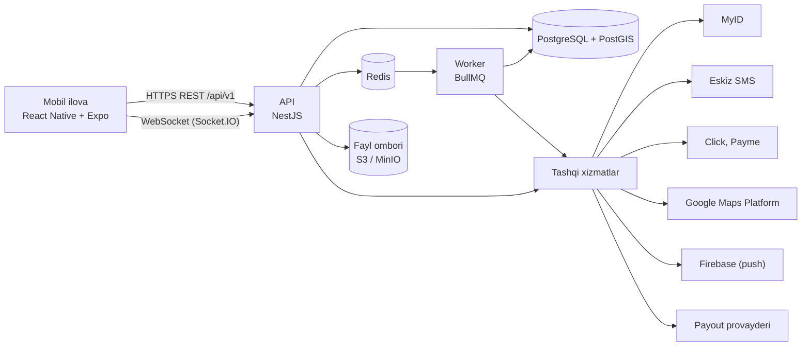

# GTM (Get the money) — arxitektura

## 1. Umumiy ko‘rinish



- **Modulli monolit**: bitta NestJS ilovasi aniq chegaralangan modullardan iborat. Mikroservislar kerak emas.
- Fon vazifalari uchun alohida **worker** jarayoni bor (xuddi shu kod, boshqa kirish nuqtasi).
- 4 ta rol bitta mobil ilovada. Qaysi ekranlar ochilishini `active_role` va ruxsatlar belgilaydi.

## 2. Nega aynan shu texnologiyalar

- Loyihada allaqachon Node.js (Express) va Expo (React Native) bor. TypeScript’ga o‘tib, butun loyiha bitta tilda qoladi.
- NestJS modullar, DI, guard va validatsiya beradi. Pul, rollar va holatlar ko‘p bo‘lgan domen uchun tartib kerak.
- PostgreSQL pul uchun tranzaksiya va qulflarni ishonchli qiladi. PostGIS esa "5 km gacha" kabi qidiruvlar uchun kerak.
- Redis’da OTP limitlari, jonli joylashuvning oxirgi nuqtasi, Socket.IO adapteri va BullMQ navbatlari turadi.
- Expo bitta koddan Android va iOS ilovasini chiqaradi (EAS build).

## 3. Repo tuzilishi (monorepo, npm workspaces)

```
D:\UstaGo
├─ CLAUDE.md
├─ docs/                      # biznes qoidalar, arxitektura, ekranlar
├─ Fronted rasmlar/           # dizayn kanvasidan eksport qilingan PNG’lar
├─ backend/                   # NestJS API + worker (TypeScript)
│  ├─ src/
│  │  ├─ main.ts               # API kirish nuqtasi
│  │  ├─ worker.ts             # BullMQ worker kirish nuqtasi
│  │  ├─ config/               # .env validatsiyasi (zod), logger
│  │  ├─ common/               # money, errors, guards, idempotency, i18n kodlari
│  │  ├─ infra/                # prisma, redis, BullMQ ulanishlari
│  │  └─ modules/              # §4dagi modullar
│  ├─ prisma/                  # schema.prisma, migrations, seed.ts
│  └─ test/                    # unit va e2e testlar
├─ mobile/                    # Expo (TypeScript)
│  ├─ app/                     # expo-router ekranlari
│  └─ src/                     # features, components, theme, i18n, api, store
├─ infra/                     # docker-compose.yml (postgres+postgis, redis, minio), .env.example
└─ legacy/                    # eski web prototip (ishlatilmaydi)
```

## 4. Backend modullari

| Modul | Vazifasi |
|---|---|
| `auth` | Ro‘yxatdan o‘tish, kirish, OTP, tokenlar, qurilmalar |
| `users` | Profil, til, ko‘rinish, faol rol, bloklash |
| `identity` | MyID sessiyasi va natijasi, PINFL takrorlanishini tekshirish, rozilik |
| `referrals` | Referal kodlar, L1 va L2 zanjiri, bonus statistikasi |
| `categories` | Xizmat turlari (Elektrik, Santexnik, …), 4 tilda nomlari |
| `orders` | Buyurtma CRUD, holatlar mashinasi (biznes qoidalar §3), `order_events` |
| `feed` | Ustalar uchun ochiq buyurtmalar: masofa, kategoriya va to‘lov turi filtri |
| `wallet` | Ledger, hisoblar, holdlar, hisob-kitob, pul yechish formulalari |
| `payments` | Click va Payme merchant callback’lari, QR sessiyalar, karta tokenlari |
| `payouts` | Pul yechish so‘rovlari va payout provayderi (feature flag ortida) |
| `tax` | Soliq usuli, o‘zini o‘zi band tekshiruvi, Xolis ulash, muddatlar |
| `trips` | Jonli joylashuv, geozona, ETA, yo‘l nuqtalarini saqlash |
| `chat` | Buyurtma ichidagi chat |
| `maps` | Google Geocoding, Places, Routes proksisi va so‘rovlar hisobi |
| `notifications` | Push (FCM) va ilova ichidagi bildirishnomalar |
| `disputes` | Shikoyatlar va admin qarorlari |
| `admin` | Admin panel API’lari (ruxsatlar bilan) |
| `settings` | Super admin sozlamalari (biznes qoidalar §12), kesh |
| `audit` | Audit jurnali |

Qoida: modul boshqa modulning jadvaliga to‘g‘ridan-to‘g‘ri yozmaydi, faqat uning servisi orqali ishlaydi. Pul faqat `wallet` servisi orqali harakatlanadi.

## 5. Ma’lumotlar bazasi (asosiy jadvallar)

Hamma pul ustunlari `BIGINT` (tiyin), vaqt `TIMESTAMPTZ` (UTC). Ekranda vaqt `Asia/Tashkent` bo‘yicha ko‘rsatiladi.

- `users`: id, phone (unique), email (unique), password_hash, lang, theme, active_role, status, referral_code (unique), referrer_id (bo‘sh faqat platforma kodi bilan kelganda), invite_code_id, created_at
- `invite_codes`: id, code (unique), kind (`PLATFORM`), created_by (super admin), max_uses, used, expires_at — birinchi foydalanuvchilar va reklama uchun (referal kod majburiy)
- `identities`: user_id, pinfl_hash (unique), pinfl_enc, last_name, first_name, middle_name, birth_date, doc_type, myid_ref, verified_at
- `devices`: user_id, device_id (ilova yaratgan tasodifiy ID), name, platform, trusted_at (SMS bilan tasdiqlangan), last_seen_at; keyin push token
- `sessions`: user_id, device_row_id, refresh_hash (SHA-256), expires_at, revoked_at, replaced_by_id (rotatsiya zanjiri)
- `consents`: user_id, type (`TERMS`, `PERSONAL_DATA`, `BIOMETRY`, `LOCATION`), version, accepted_at, device
- `staff_permissions`: user_id, role (`ADMIN`, `SUPER_ADMIN`), permissions[]
- `executor_profiles`: user_id, categories[], rating, free_period_start, free_period_end, tax_method, tax_status, tax_valid_until
- `tax_verifications`: id, user_id, method, status, source (`AUTO`, `MANUAL`), file_key, reviewer_id, checked_at, valid_until
- `orders`: id, number (sequence), customer_id, executor_id, category_id, title, description, photos[], address_text, location (PostGIS point), entrance, floor, apartment, landmark, time_from, time_to, price, payment_method, status, fee_bps_snapshot, ref_l1_bps_snapshot, ref_l2_bps_snapshot, fee, fee_demo, fee_real (qabul qilinganda oldindan hisoblanadi), created_at, accepted_at, finished_at ("Ishni tugatdim"), customer_paid_at ("To‘ladim"), executor_received_at ("Pulni qabul qildim"), paid_at, cancelled_by, cancel_reason
- `order_events`: order_id, from_status, to_status, actor_id, at, payload
- `wallet_accounts`: id, owner_type (`USER`, `PLATFORM`), owner_id, kind (`REAL`, `DEMO`, `PLATFORM_REVENUE`, `PLATFORM_MARKETING` (demo ishlar referali), `PAYOUT_PROVIDER_FEES` (bank o‘tkazma xizmati, tranzit — daromad emas), `DEMO_SINK`, `PAYMENT_CLEARING`, `PAYOUT_CLEARING`), balance (kesh)
- `ledger_transactions`: id, type, order_id, idempotency_key (unique), created_by, created_at
- `ledger_entries`: id, transaction_id, account_id, amount (manfiy yoki musbat). Har bir tranzaksiyada yig‘indi 0
- `wallet_holds`: id, user_id, order_id (unique), amount_demo, amount_real (qabul qilinganda oldindan hisoblanadi), status (`ACTIVE`, `SETTLED`, `RELEASED`). Faol hold’dagi demo bepul davr tugaganda yonmaydi
- `payments`: id, provider, purpose (`TOPUP`, `ORDER`), user_id, order_id, amount, status, provider_txn_id (unique), raw, timestamps
- `payment_sessions`: id, order_id, provider, qr_payload, expires_at, status
- `cards`: user_id, provider, token, masked_pan, brand
- `payouts`: id, user_id, amount, fee, card_id, status, provider_ref, timestamps
- `trips`: id, order_id, executor_id, started_at, ended_at, end_reason, last_eta_sec, last_distance_m
- `trip_points`: trip_id, at, location (point), accuracy_m, speed. 30 kundan keyin o‘chiriladi
- `messages`: id, order_id, sender_id, text, attachments[], created_at, read_at
- `disputes`: id, order_id, opened_by, reason, status, decision, decided_by, approved_by (super admin)
- `notifications`, `categories`, `settings`, `audit_logs`, `maps_usage`

Indekslar: `orders(status, location)` GIST, `orders(customer_id)`, `orders(executor_id)`, `ledger_entries(account_id)`, `trip_points(trip_id, at)`.

## 6. API (REST, `/api/v1`)

Autentifikatsiya: `Authorization: Bearer <access>`. Xato formati: `{ "code": "ORDER_NOT_FOUND", "params": {} }`. Pul maydonlari tiyinda va JSON’da satr ko‘rinishida: `"1550000"` (15 500 so‘m). Satr — JS `number`ning aniqlik chegarasi va float xatolaridan himoya.

| Guruh | Endpointlar |
|---|---|
| Auth | `GET /auth/invite/:code` (kodni tekshirish, "Sizni {ism} taklif qildi"), `POST /auth/register` (`referral_code` majburiy — `AUTH_REFERRAL_REQUIRED`), `POST /auth/otp/verify` (`purpose`: `REGISTER` yoki `LOGIN` — yangi qurilma), `POST /auth/otp/resend`, `POST /auth/login` (notanish qurilmada `otp_required`), `POST /auth/refresh`, `POST /auth/logout`, `POST /auth/password/reset`, `POST /auth/password/reset/confirm` |
| Identity | `POST /identity/myid/session`, `POST /identity/myid/complete` |
| Men | `GET /me`, `PATCH /me` (til, ko‘rinish), `POST /me/role`, `GET /me/referrals`, `GET /me/devices`, `DELETE /me/devices/:id`, `PUT /me/devices/current/push-token`, `GET /me/jobs` (usta: faol ishlar va tarix) |
| Buyurtmachi | `POST /orders` (tasdiqlanmagan to‘lov bo‘lsa — `ORDER_CUSTOMER_CONFIRMATION_REQUIRED`), `GET /orders`, `GET /orders/:id`, `POST /orders/:id/cancel`, `POST /orders/:id/confirm`, `POST /orders/:id/pay`, `POST /orders/:id/paid` ("To‘ladim", naqd va Xolis), `POST /orders/:id/dispute` ("Muammo bor"; `note` ixtiyoriy) |
| Usta | `GET /feed`, `GET /orders/:id/accept-preview` (BJ2/BJ3 hisob-kitobi), `POST /orders/:id/accept` (tasdiqlanmagan to‘lov bo‘lsa — `ORDER_EXECUTOR_CONFIRMATION_REQUIRED`), `POST /orders/:id/decline`, `POST /orders/:id/depart`, `POST /orders/:id/arrive`, `POST /orders/:id/start`, `POST /orders/:id/finish` ("Ishni tugatdim"), `POST /orders/:id/payment-received` ("Pulni qabul qildim"), `POST /orders/:id/payment-not-received` ("Pul kelmadi" → nizo), `POST /orders/:id/payment-session` |
| Hamyon | `GET /wallet`, `GET /wallet/transactions` (BJ5 tarixi, `before` kursori bilan), `POST /wallet/topup`, `POST /wallet/withdraw/preview`, `POST /wallet/withdraw`, `GET /wallet/cards`, `POST /wallet/cards` |
| Soliq | `GET /tax/status`, `POST /tax/self-employed`, `POST /tax/xolis` |
| Chat | `GET /orders/:id/messages`, `POST /orders/:id/messages`, `POST /orders/:id/messages/read` |
| Xarita | `GET /maps/reverse-geocode`, `GET /maps/autocomplete`, `GET /maps/place/:id` |
| Umumiy | `GET /config` (kirishdan oldin kerak bo‘lgan sozlamalar), `GET /categories`, `POST /uploads/presign` (rasm yuklash uchun presigned URL) |
| Callback | `POST /payments/payme`, `POST /payments/click/prepare`, `POST /payments/click/complete` |
| Admin | `GET /admin/users`, `POST /admin/users/:id/block`, `GET /admin/verifications`, `POST /admin/verifications/:id/decide`, `GET /admin/disputes`, `POST /admin/disputes/:id/decide`, `GET /admin/orders` |
| Super admin | `GET/PUT /sa/settings`, `GET/POST /sa/invite-codes` (platforma kodlari), `GET/POST /sa/staff`, `PUT /sa/staff/:id/permissions`, `GET /sa/finance/summary`, `GET /sa/finance/ledger`, `POST /sa/disputes/:id/approve-refund`, `GET /sa/maps/usage` |

`GET /wallet` javobi: `real`, `demo` (hali amal qiladigan demo), `holds`, `available`, `must_keep`, `max_withdraw`, `demo_granted` (berilgan demo bonus), `free_period` (`ends_at`, `days_left`, `active`; faqat ustada).

OpenAPI spetsifikatsiyasi NestJS’dan avtomatik yaratiladi. Mobil ilova API klientini shundan generatsiya qiladi.

## 7. Realtime (Socket.IO)

- Ulanishda JWT tekshiriladi. Xonalar: `user:{id}` va `order:{id}` (faqat shu buyurtma tomonlari).
- Serverdan: `order.status`, `payment.status`, `trip.position` (lat, lng, heading, at), `trip.eta` (sec, meters), `trip.ended`, `chat.message`, `notification`.
- Mijozdan: `trip.update` (faqat usta, faqat `EN_ROUTE` holatida), `chat.typing`.
- Ko‘p nusxada ishlash uchun Redis adapter ishlatiladi.

## 8. Fon vazifalari (BullMQ)

| Vazifa | Qachon | Nima qiladi |
|---|---|---|
| `free-period-expire` | har soat | Tugagan bepul davr: band qilinmagan demo yonadi (faol ishlardagi demo qoladi), "soliq usulini tanlang" push |
| `free-period-remind` | har kuni 10:00 (Toshkent) | 7, 3, 1 kun qolganda eslatma |
| `tax-status-check` | har kuni | O‘zini o‘zi band muddati; eslatma; muddat o‘tsa `EXPIRED` |
| `trip-eta-refresh` | har 120 soniyada, faol safar bo‘yicha | Google Routes orqali ETA |
| `trip-timeout` | har 5 daqiqada | 180 daqiqadan uzoq safarni to‘xtatadi |
| `trip-points-cleanup` | har kuni | 30 kundan eski nuqtalarni o‘chiradi |
| `payment-session-expire` | har daqiqada | Muddati o‘tgan QR sessiyalar |
| `order-confirm-remind` | har soat | "To‘ladim" yoki "Pulni qabul qildim" bosilmagan buyurtmalar: 2 va 24 soatdan keyin eslatma, 48 soatdan keyin admin vazifasi |
| `payout-process` | navbat | Pul yechish so‘rovlarini provayderga yuboradi |
| `ledger-reconcile` | har kuni | Balans keshi va ledger yig‘indisini solishtiradi, farq bo‘lsa alert |

## 9. Integratsiyalar (adapter orqali)

Har bir tashqi xizmat uchun interfeys yoziladi va ikkita implementatsiya bo‘ladi: haqiqiy va `mock`. Qaysi biri ishlashini `.env` belgilaydi.

| Adapter | Provayder | Muhim eslatmalar |
|---|---|---|
| `IdentityProvider` | MyID | Backend sessiya yaratadi, mobil SDK pasport va yuzni tekshiradi, backend natijani oladi. Kalitlarni (`sessionId`, `clientHash`, `clientHashId`) MyID savdo bo‘limi beradi |
| `SmsProvider` | Eskiz.uz | Token muddatini kuzatish kerak. Xato bo‘lsa jim davom etilmaydi, xato qaytariladi. SMS matn shablonini oldindan tasdiqlatish kerak bo‘lishi mumkin |
| `PaymentProvider` | Payme | Merchant API (JSON-RPC): `CheckPerformTransaction`, `CreateTransaction`, `PerformTransaction`, `CancelTransaction`, `CheckTransaction`, `GetStatement`. Basic auth (`Paycom:<KEY>`). Summa tiyinda. Hujjat: developer.help.paycom.uz |
| `PaymentProvider` | Click | SHOP API: `Prepare` va `Complete`, MD5 imzo. Summa so‘mda. Hujjat: docs.click.uz |
| `PayoutProvider` | aniqlanmagan | Kartaga pul chiqarish. Yuridik sxema tasdiqlangunga qadar feature flag ortida |
| `TaxStatusProvider` | Soliq qo‘mitasi | API yo‘q bo‘lsa — qo‘lda tekshiruv navbati (AD1) |
| `XolisProvider` | Paynet Xolis | Ochiq API yo‘q — QR va telefon qo‘lda tekshiriladi |
| `MapsProvider` | Google | Geocoding, Places Autocomplete (sessiya tokeni bilan), Routes `computeRoutes`. Server kaliti IP bo‘yicha cheklanadi. Har bir so‘rov `maps_usage`ga yoziladi (SA6: oylik bepul limit) |
| `PushProvider` | Firebase Cloud Messaging | `firebase-admin`. Tokenlar `expo-notifications` orqali olinadi |
| `StorageProvider` | S3 / MinIO | Rasmlar presigned URL orqali yuklanadi, 5 MB gacha. EXIF (shu jumladan GPS) o‘chiriladi |

## 10. Xavfsizlik

- Parollar `argon2id` bilan saqlanadi.
- Access token 15 daqiqa, refresh token 30 kun. Refresh token rotatsiya qilinadi, bazada xesh holida saqlanadi, qayta ishlatilsa hamma sessiyalar yopiladi.
- RBAC: `@Roles()` va `@Permissions()` guard’lari. Buyurtma ma’lumotini faqat uning tomonlari va ruxsati bor admin ko‘radi.
- Cheklovlar: OTP (telefon va IP bo‘yicha, qiymatlari `settings`da: `otp_phone_limit`, `otp_ip_limit`, `otp_limit_window_sec`), login urinishlari, ochiq endpointlar.
- PINFL `AES-256-GCM` bilan shifrlanadi, qidirish va takrorlanishni tekshirish uchun `HMAC-SHA256` xeshi saqlanadi. Kalitlar `.env` yoki KMS’da turadi.
- Loglarda shaxsiy ma’lumot bo‘lmaydi. Admin ro‘yxatlarida telefon niqoblanadi: `+998 93 *** 21 08`.
- Callback’lar imzo yoki auth bilan tekshiriladi. `provider_txn_id` unique, qayta kelgan callback idempotent javob oladi.
- Kiruvchi ma’lumotlar DTO bilan validatsiya qilinadi. `helmet`, cheklangan CORS, faqat HTTPS.
- Zaxira: har kuni `pg_dump` + WAL arxiv. Oyiga bir marta tiklash sinab ko‘riladi.

## 11. Mobil ilova

- **Navigatsiya**: `expo-router`. Pastki tab paneli yo‘q — dizayn (BY1, BJ1) bo‘yicha bosh sahifa `active_role`ga qarab ochiladi, bo‘limlar sarlavha panelidagi tablarda, qolgani U1 yon menyusida:
  - Buyurtmachi (BY1): Barchasi / Faol / Yakunlangan; buyurtma → BY3, chat (BY4) buyurtmadan ochiladi.
  - Usta (BJ1): Yangi / Mening ishlarim / Tarix; hamyon sarlavhadagi balansdan va menyudan.
  - Admin va super admin bo‘limlari menyudan, faqat ruxsat bo‘lsa ochiladi.
  - Buyurtma ekrani bitta (`/order/[id]`): buyurtmachiga BY3, ustaga BJ2 va ish qadamlari — `viewer_role`ga qarab.
- **Holat boshqaruvi**: server ma’lumotlari uchun TanStack Query, sessiya va sozlamalar uchun Zustand.
- **i18n**: `i18next` + `react-i18next` + `expo-localization`. Fayllar: `src/i18n/uz.json`, `ru.json`, `en.json`, `tg.json`. Backend xato kodlari i18n kalitlariga moslanadi. Hermes’da `Intl.PluralRules` bo‘lmasa, polyfill qo‘shiladi.
- **Pul va sana formati**: o‘z yordamchi funksiyalari (`180 000 so‘m`, `18.10.2026`, `+998 90 123 45 67`). `Intl`ga tayanilmaydi.
- **Mavzu**: tokenlar `docs/03-ekranlar-va-dizayn.md`dan olinadi. Kunduzgi, tungi va avto rejim bor. "Matn o‘lchami: Katta" rejimida shrift 1.15 barobar kattalashadi. Shrift — Golos Text (`expo-font`).
- **Xarita**: `react-native-maps`, Android va iOS’da `PROVIDER_GOOGLE`. Kalitlar Expo config orqali beriladi.
- **Joylashuv**: `expo-location` + `expo-task-manager`. Fon rejimida yangilanadi, Androidda foreground service bildirishnomasi bilan. Ruxsat so‘rashdan oldin BJ11 tushuntirish ekrani ko‘rsatiladi.
- **Push**: `expo-notifications`. Qurilma tokeni backendga yuboriladi.
- **MyID**: rasmiy React Native paketi bo‘lmasa, Expo Modules API bilan MyID Android va iOS SDK’lariga o‘ram yoziladi. Buning uchun EAS development build kerak.
- **Boshqalar**: `expo-secure-store` (refresh token), `react-native-qrcode-svg` (BJ4 QR), `expo-linking` (referal havola `{APP_DOMAIN}/r/{code}`, Android App Links va iOS Universal Links).
- **Qulaylik**: bosiladigan joy kamida 48 px, asosiy matn kamida 16 px, ikonka-tugmalarda `accessibilityLabel`, pul amallaridan oldin tasdiqlash.

## 12. Muhitlar va joylashtirish

- `development`: lokal Docker, hamma adapterlar `mock`.
- `staging`: Payme va Click test muhiti, haqiqiy SMS test raqamlarga, Google kalitlari cheklangan.
- `production`: API va worker Docker image’lari, Nginx yoki Caddy (TLS), domen `api.{APP_DOMAIN}`. Standart variant — O‘zbekistondagi hosting (§14 yuridik talablar).
- Ilova nomi, domen va identifikatorlar sozlamadan olinadi: `APP_NAME` (hozircha `GTM`, ishchi nom), `APP_DOMAIN` (backend `.env` va mobil `app.config.ts`), `APP_BUNDLE_ID` (iOS `bundleIdentifier` va Android `package`). Nom va domen hali yakuniy emas — biznes qoidalar §13. `APP_BUNDLE_ID` birinchi relizdan keyin o‘zgarmaydi.
- Monitoring: Sentry (mobil va backend), uptime tekshiruvi, JSON loglar (`pino`).
- CI (GitHub Actions): lint, typecheck, testlar, Prisma migratsiya tekshiruvi. Teg qo‘yilganda EAS build.

## 13. Ish bosqichlari

Har bir bosqich tugaganda testlar o‘tishi va tegishli ekranlar ishlashi kerak.

| Bosqich | Nima qilinadi | Tayyor degani |
|---|---|---|
| 0. Poydevor | Monorepo, TypeScript, lint, Docker (Postgres, Redis, MinIO), Prisma, sozlamalar seed’i, 4 tilli i18n skeleti, mavzu tokenlari, CI. Eski prototip `legacy/`ga | `docker compose up` va `npm test` ishlaydi |
| 1. Kirish | Ro‘yxatdan o‘tish, kirish, OTP (Eskiz mock), MyID (mock), PINFL takrorlanishi, rol tanlash va almashtirish, referal havola yoki kod (majburiy), platforma kodlari | Main, K2–K4, U1 ishlaydi |
| 2. Buyurtmalar | Yaratish (BY2 + BY6 xarita belgisi), feed (BJ1, PostGIS radius), qabul qilish sharti va hold (BJ2, BJ3), holatlar mashinasi, chat (BY4), push | Buyurtma `PUBLISHED`dan `DONE_BY_EXECUTOR`gacha boradi |
| 3. Hamyon | Ledger, holdlar (qabul qilinganda oldindan hisob-kitob), hisob-kitob, referal (demo ishlarda — marketing budjetidan), demo va bepul davr, tarix (BJ5), referal ekrani (U2), naqd va Xolis tasdig‘i ("To‘ladim" / "Pulni qabul qildim", cheklovlar — BY9, BY10, BJ13, BJ14), pul yechish formulasi va ledger yozuvlari | T1–T18 test holatlari o‘tadi |
| 4. To‘lovlar | Payme va Click (sandbox), QR sessiya (BJ4), to‘ldirish (BJ6), hisobdan to‘lash (BY5), pul yechish (BJ7: karta, payout mock) | Sandbox’da to‘lov `PAID`gacha boradi, callback’lar idempotent |
| 5. Soliq | Usul tanlash (BJ8), o‘zini o‘zi band (BJ9, AD1 navbati), Xolis (BJ10), SA5 | Bepul davrdan keyin usulsiz ish olinmaydi |
| 6. Jonli joylashuv | BJ11, BJ12, BY7, BY8, Routes ETA, geozona, saqlash muddati, SA6 | Buyurtmachi ustani xaritada ko‘radi, yetib kelganda kuzatuv to‘xtaydi |
| 7. Admin | AD1–AD3, SA1–SA4, ruxsatlar, audit, moliya hisobotlari | Admin faqat berilgan ruxsatlar doirasida ishlaydi |
| 8. Chiqarish | Xavfsizlik tekshiruvi, jonli joylashuv uchun yuklama testi, maxfiylik matnlari, yuridik ro‘yxat, do‘konlarga chiqarish (EAS) | Biznes qoidalar §14 bajarilgan |
